# BASH CHALLENGES
---
***1.***
***(a)Display the path of your current directory***
> pwd 

***(b)List out the contents of your current directory***
> ls

***( c.) List out the contents of your current directory including hidden files***
> ls -al

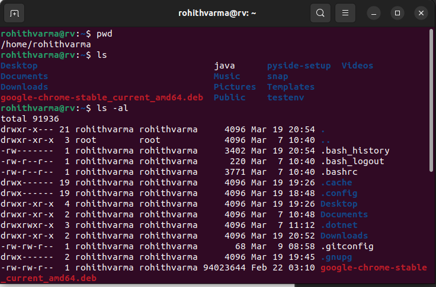
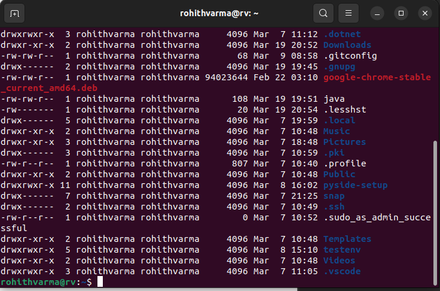

**2.**
**( a.) Create a new directory named a**
> mkdir a

**( b.) Move to the newly created directory**
> cd a

**( c.) Create a blank file named “file1”**
> touch file1

**( d.) Display the file type of “file1”**
> file file1

**( e.) Add the line “Hello World” to “file1” using the command echo**
> echo "HelloWorld"|cat > file1

**( f.) Display the contents of “file1”**
> cat file1

**( g.) Display the file type of “file1” again**
> file file1

**3.**
***( a.) Stay in directory a. Create a file “file2” and add the contents below using the  command cat
"First Line Second Line Third Line"***
> cat > file2<<eof
First Line Second Line Third Line
eof

**(b)Display the contents of “file2”**
> cat file2

**( c.) Display the contents of “file2” with the lines reversed**
> rev file2

**4.**
**( a.) Stay in directory a. Concatenate the contents of “file1” and “file2” and save them into a new file “file3”**
> cat file1 file2 > file3

**( b.) Display the contents of “file3”**
> cat file3

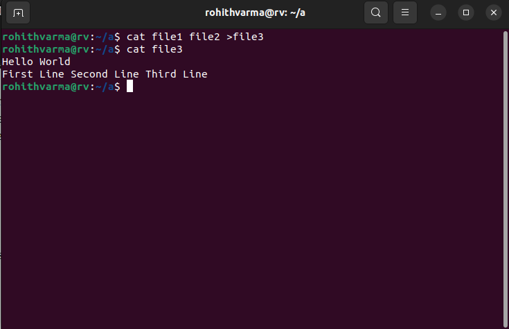
**5.**
**( a.) Stay in directory a. Create 2 directories b/c with a single command **
> mkdir -p b/c

**( b.) Create a new directory d**
> mkdir d

**( c.) Copy the directory d to directory c using a single command**
> cp -r d b/c

**( d.) Delete the directory d in the current directory a**
> rmdir d

**( e.) Copy “file3” to the directory d with a single command**
> cp file3 b/c/d

**6.**
**( a.) Go to directory d and rename “file3” to “file0”**
> cd b/c/d
 mv file3 file0
 
**( b.) Stay in the same directory and move “file0” to directory a**
> cp file0  /home/rohithvarma/a

**7.**
**( a.) Go to your home directory**
> cd ~

**( b.) Create a file named “test” in the directory a/b/c/d**
> touch a/b/c/d/test

**( c.) Stay in the home directory. Find and display the path of “test”**
> cat a/b/c/d/test

**8.**
**( a.) Go to directory a. Get the man page of grep and save its contents to a file named “grepman.txt”**
> cd a
man grep|cat > grepman.txt

**( b.) Print the lines containing the word “FILE” (Case sensitive) in the file “grepman.txt”**
> cat grepman.txt|grep FILE

 
**9.**
**( a.) Go to directory a and remove the directory b with a single command**
> cd a

***( b.) Remove the files starting with the word “file” with a single command.***
 > rm -rf file*
 

**10**
***a.) Download the compressed file from the drive. https://drive.google.com/drive/folders/1PG3ZlpFu6nQSNjpCNuceoGcNey00bhPP?usp=sharing***
**( b.) Extract the compressed file using CLI.**
> tar -xfz Downloads/Filez.tar.gr

**( c.) Decode the base64 content and display the content of “Flag.txt”using CLI.**
> base65 -d Flag.txt
 
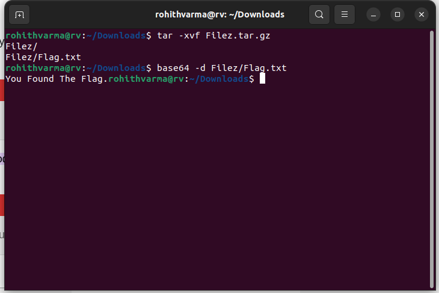

**11.**
**( a.) Go to https://blog.bi0s.in/  and download the logo.png image using wget**
> wget https://blog.bi0s.in/assets/logo.png
 
 
**( b.) Do the same using curl**
> curl -o Bioslogo.png https://blog.bi0s.in/assets/logo.png
 
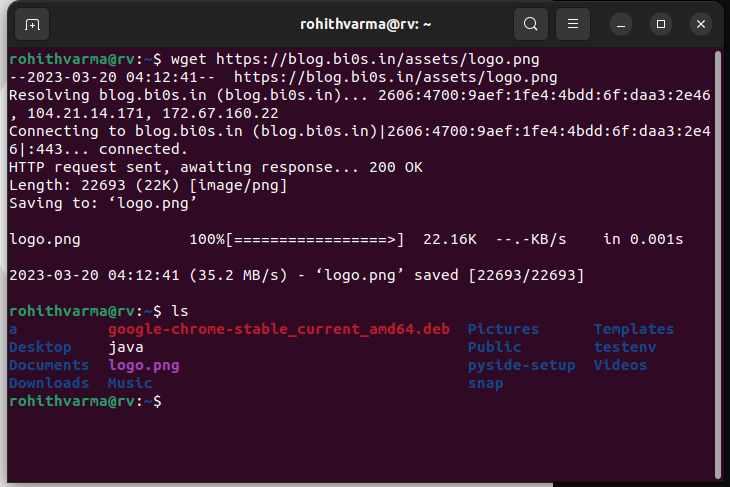
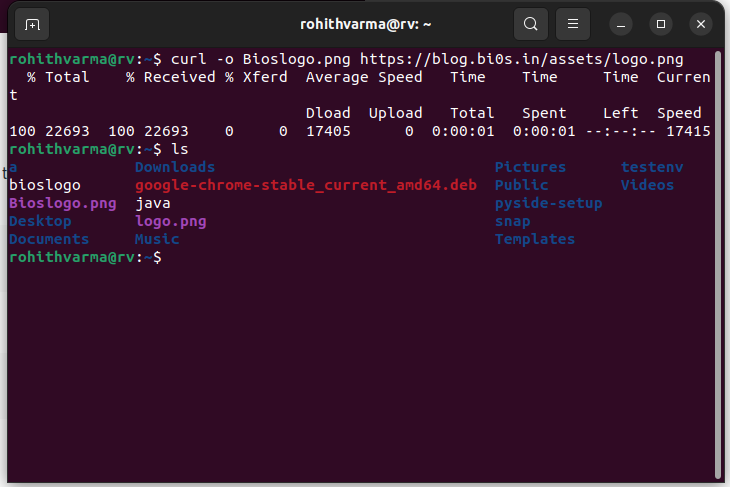

**12.**
***( a.) Ping google.com and find the lowest time taken to get a response (Stop pinging after getting 5 responses)***
 > ping google.com
 
 
**( b.) Ping google.com 6 times and find the average time taken to get a response**
> ping -c 5 google.com
 
 

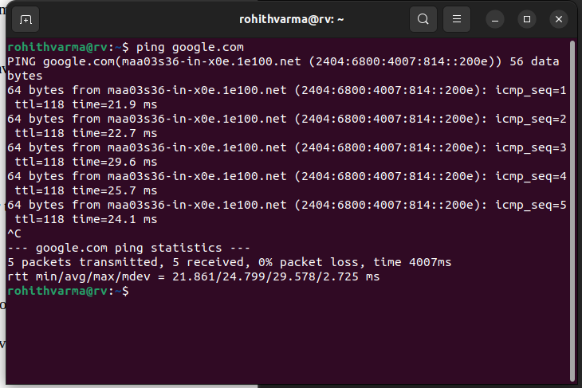
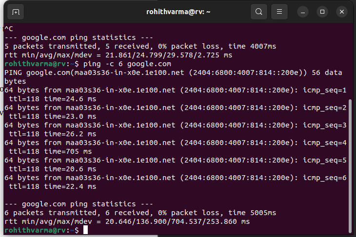

**13.** **Connect to your own system using telnet**
 
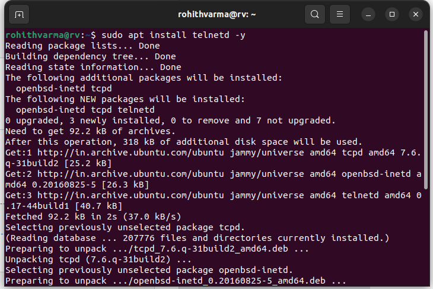
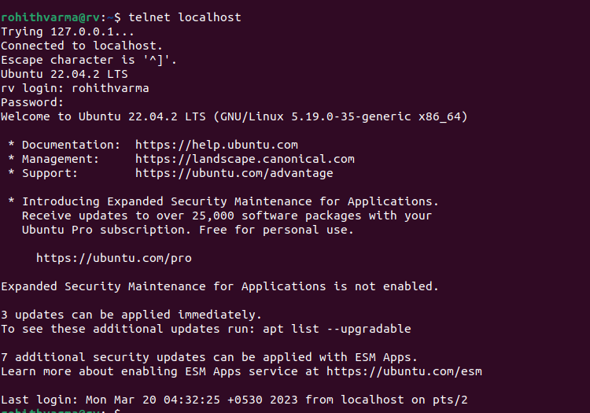

**14**
**( a.) Learn about nmap and use that scanner to scan your own machine**
[Resoruce I reffered to!](https://www.geeksforgeeks.org/nmap-command-in-linux-with-examples/)
**( b.) Use nmap to scan scanme.nmap.org**
 

 
 

**15**
***( a.) Create a chat application using nc on your local machine with one terminal as server and other as the client***
***( b.) Transfer a file from server to client (save that file with another name) and display the file.***
 
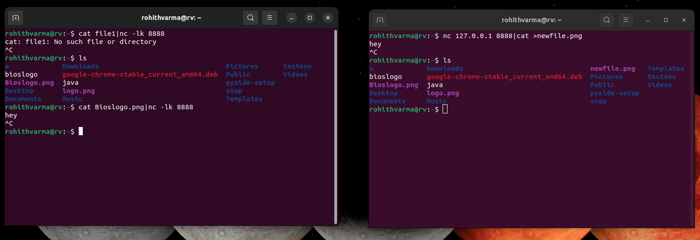

